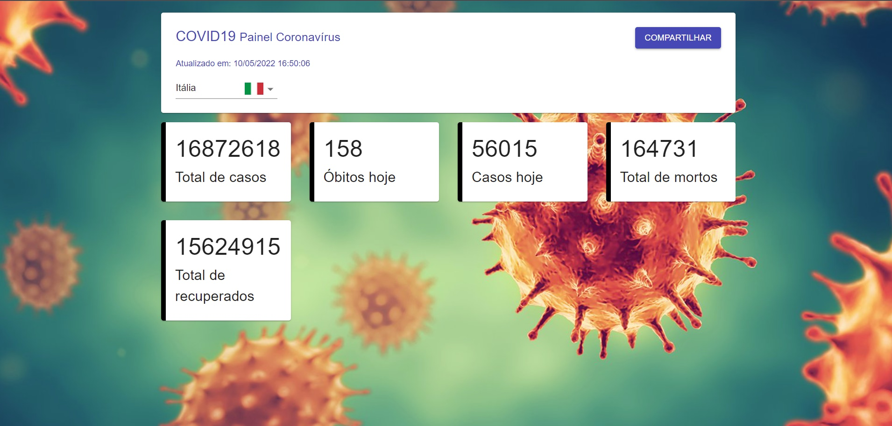

# Projeto COVID19 - DIO

Projeto em React desenvolvido através do curso de React pela DIO.
 
Projeto de Mapeamento de COVID 19 pelo mundo, consumindo uma API que trás os dados ao vivo sobre os casos de Covid.

